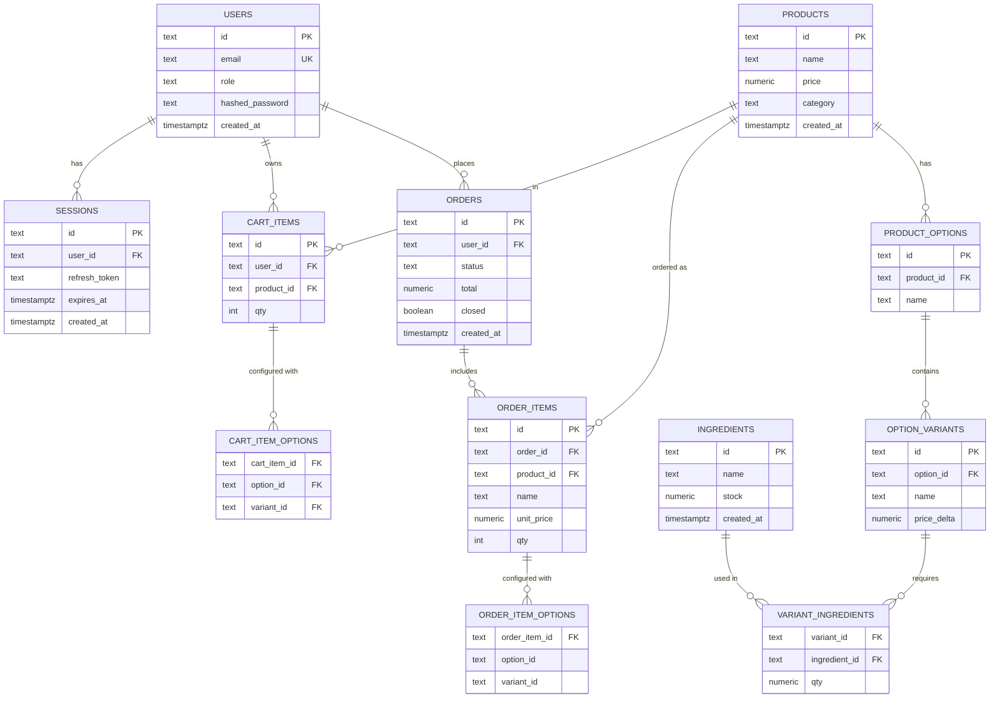

```mermaid
erDiagram
    USERS ||--o{ SESSIONS : "has"
    USERS ||--o{ CART_ITEMS : "owns"
    USERS ||--o{ ORDERS : "places"

    PRODUCTS ||--o{ CART_ITEMS : "in"
    PRODUCTS ||--o{ ORDER_ITEMS : "ordered as"
    PRODUCTS ||--o{ PRODUCT_OPTIONS : "has"

    PRODUCT_OPTIONS ||--o{ OPTION_VARIANTS : "contains"
    OPTION_VARIANTS ||--o{ VARIANT_INGREDIENTS : "requires"
    INGREDIENTS ||--o{ VARIANT_INGREDIENTS : "used in"

    ORDERS ||--o{ ORDER_ITEMS : "includes"
    CART_ITEMS ||--o{ CART_ITEM_OPTIONS : "configured with"
    ORDER_ITEMS ||--o{ ORDER_ITEM_OPTIONS : "configured with"

    USERS {
        text id PK
        text email UK
        text role
        text hashed_password
        timestamptz created_at
    }

    SESSIONS {
        text id PK
        text user_id FK
        text refresh_token
        timestamptz expires_at
        timestamptz created_at
    }

    CART_ITEMS {
        text id PK
        text user_id FK
        text product_id FK
        int qty
    }

    CART_ITEM_OPTIONS {
        text cart_item_id FK
        text option_id FK
        text variant_id FK
    }

    PRODUCTS {
        text id PK
        text name
        numeric price
        text category
        timestamptz created_at
    }

    PRODUCT_OPTIONS {
        text id PK
        text product_id FK
        text name
    }

    OPTION_VARIANTS {
        text id PK
        text option_id FK
        text name
        numeric price_delta
    }

    VARIANT_INGREDIENTS {
        text variant_id FK
        text ingredient_id FK
        numeric qty
    }

    INGREDIENTS {
        text id PK
        text name
        numeric stock
        timestamptz created_at
    }

    ORDERS {
        text id PK
        text user_id FK
        text status
        numeric total
        boolean closed
        timestamptz created_at
    }

    ORDER_ITEMS {
        text id PK
        text order_id FK
        text product_id FK
        text name
        numeric unit_price
        int qty
    }

    ORDER_ITEM_OPTIONS {
        text order_item_id FK
        text option_id
        text variant_id
    }

```